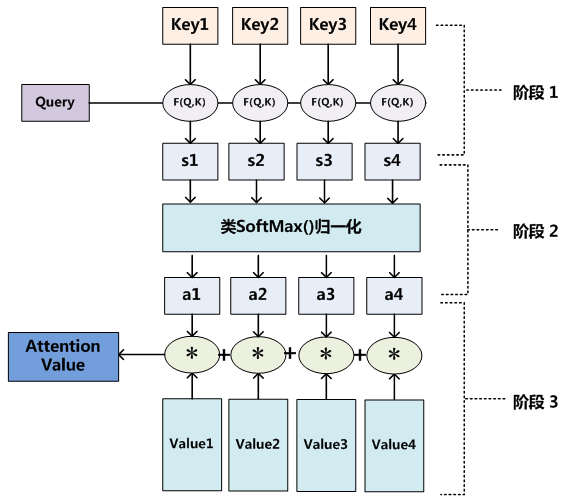
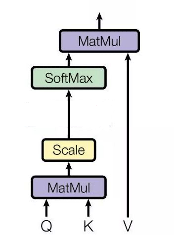
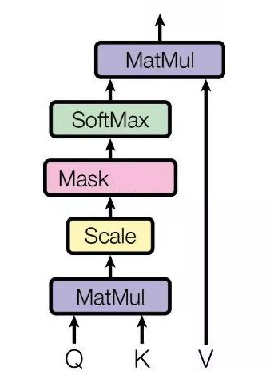

# Attention

LSTM 解决了序列长距离依赖问题，但是单词超过 200 时就会失效。而 Attention 机制可以更加好的解决序列长距离依赖问题，并且具有并行计算能力

## 具体实现

本质思想：从大量信息中有选择地筛选出少量重要信息并聚焦到这些重要信息上，忽略不重要的信息

计算 Query 和 Values 中每个信息的相关程度

将 Query 和键值对（把 Values 拆分成键值对的形式）映射到输出上，其中 Query、每个 key、每个 value 都是向量，输出是 V 中所有 value 的加权，权重是由 Query 和每个 key 计算出来的，具体步骤

- 计算 Query 和 Key 的相似度，计算方法有四种
  - 点乘（Transformer 使用）：$f(Q,K_i)=Q^TK_i$
  - 权重：$f(Q,K_i)=Q^TWK_i$
  - 拼接权重：$f(Q,K_i)=W[Q^T;K_i]$
  - 感知器：$f(Q,K_i)=V^Ttanh(WQ+UK_i)$
- 将得到的相似度进行 softmax 操作，进行归一化：$\alpha_i=softmax(\frac{f(Q,K_i)}{\sqrt{d_k}})$
  - 除以 $\sqrt{d_k}$ 的作用：假设 $Q,K$ 里的元素的均值为 0，方差为 1，那么 $A^T=Q^TK$ 中元素的均值为 0，方差为 d。当 d 变得很大时，A 中的元素的方差也会变得很大，如果 A 中的元素方差很大（分布的方差大，分布集中在绝对值大的区域），在数量级较大时， softmax 将几乎全部的概率分布都分配给了最大值对应的标签，由于某一维度的数量级较大，进而会导致 softmax 未来求梯度时会消失。总结一下就是 softmax(A) 的分布会和 d 有关。因此 𝐴 中每一个元素除以 $\sqrt{d_k}$ 后，方差又变为 1，并且 A 的数量级也将会变小
- 针对计算出来的权重 $\alpha_i$，对 $V$ 中的所有 values 进行加权求和计算，得到 Attention 向量：$Attention=\sum^m_{i=1}\alpha_iV_i$

## Self Attention 模型

上图为 Self Attention 模型的架构，有三个输入 Q、K、V，来自句子 X 的词向量 x 的线性转化（即对于词向量 x，给定三个可学习的矩阵参数 $W_Q,W_K,W_V$，x 分别右乘上述矩阵得到 Q、K、V）

## Self Attention、RNN 和 LSTM 之间的区别

- RNN、LSTM：需要依次序列计算，对于远距离的相互依赖的特征，要经过若干时间步步骤的信息累积才能将两者联系起来，而距离越远，有效捕获的可能性越小
- Self Attention
  - 能更容易捕获句子中长距离的相互依赖的特征，因为 Self Attention 在计算过程中会直接将句子中任意两个单词的联系通过一个计算步骤直接联系起来，所以远距离依赖特征之间的距离被极大缩短，有利于有效地利用这些特征
  - Self Attention 对于一句话中的每个单词都可以单独的进行 Attention 值的计算，对计算的并行性有直接帮助作用，而对于必须得依次序列计算的 RNN 而言，是无法做到并行计算的

## Masked Self Attention 模型

Self Attention 通过 Scale 之前的步骤得到了一个 attention map，而 mask 就是沿着对角线把灰色的区域用 0 覆盖掉，不给模型看到未来的信息

## Multi-Head Self Attention 模型

把 Self Attention 得到的注意力值 $Z$ 切分成 n 个 $Z_1,Z_2,\dots,Z_n$，然后通过全连接层获得新的 $Z^{'}$

为了使得输出与输入结构相同，拼接矩阵 $Z_i$ 后乘以一个线性 $W_o$ 得到最终的 $Z$

多头注意力指的是，把原始信息放到多个子空间中，保证 attention 可以注意到不同子空间的信息，从而捕捉到更加丰富的特征信息