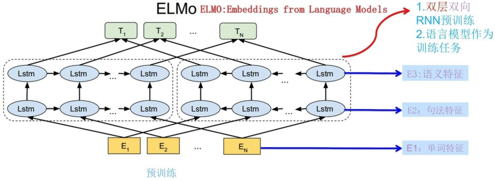

# ELMo, Embeddings from Language Models

解决的问题：处理 NLP 任务中多义词问题（前面的词向量都是静态的，一个词无法根据句子的不同而选择适应的词向量）

本质思想：根据上下文动态调整词向量。事先用语言模型学好一个单词的词向量（此时还无法区分多义词），在实际使用时，由于单词已经具备特定的上下文，根据上下文的单词语义去调整单词的词向量表示，这样调整后的词向量更能表达在这个上下文中的具体含义，从而解决多义词的问题

ELMo 采用了典型的两阶段过程

- 利用语言模型进行预训练

  

  - 网络结构采用了双层双向 LSTM
  - 图中左端的前向双层 LSTM 代表正方向编码器，输入的是从左到右顺序的预测单词外的上文
  - 图中右端的逆向双层 LSTM 代表反方向编码器，输入的是从右到左逆序的预测单词外的下文
  - 使用这个网络结构利用大量语料做语言模型任务就能预先训练好这个网络，如果训练好这个网络后，输入一个新句子，句子中每个单词都能得到对应的三个词向量
    - E1：单词的词向量
    - E2：第一层双向 LSTM 中对应单词位置的词向量，这层编码单词的**句法信息**更多一些
    - E3：第二层双向 LSTM 中对应单词位置的词向量，这层编码单词的**语义信息**更多一些

- 在做下游任务时，从预训练网络中提取对应单词的网络各层的词向量作为新特征补充到下游任务中

  - 将句子 X 作为预训练好的 ELMo 网络的输入，句子中每个单词都能获得对应的三个词向量
  - 分别赋予这三个词向量权重（可以学习得来），根据各自权重累加求和，将三个词向量整合成一个
  - 将整合后的词向量作为句子 X 在下游任务的网络结构中对应的单词输入，以此作为补充的新特征给下游任务使用