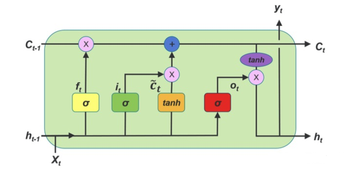

# LSTM, Long Short-Term Memory

解决的问题：RNN 缺乏长距离的时序依赖问题

存在的问题：单词超过 200 时就会失效

上图为 LSTM 的 RNN 门控结构，LSTM 的前向传播过程包括

- 遗忘门：决定丢弃哪些信息，遗忘门接收 $t-1$ 时刻的状态 $h_{t-1}$，以及当前的输入 $x_t$，经过 sigmoid 函数后输出一个 0 到 1 之间的值 $f_t$
  - 输出：$f_t=\sigma(W_fh_{t-1}+U_fx_t+b_f)$
- 输入门：决定保留哪些信息，并更新细胞状态，输入门的取值由 $h_{t-1}$ 和 $x_t$ 决定，经过 sigmoid 函数后输出一个 0 到 1 之间的值 $i_t$，而 $tanh$ 函数则创造一个当前细胞状态的候选 $a_t$
  - 输出：$i_t=\sigma(W_ih_{t-1}+U_ix_t+b_i)$，$\tilde{C_t}=tanhW_ah_{t-1}+U_ax_t+b_a$

- 细胞状态：旧细胞状态 $C_{t-1}$ 被更新到新的细胞状态 $C_t$ 上
  - 输出：$C_t=C_{t-1}\odot f_t+i_t\odot \tilde{C_t}$
- 输出门：决定最后输出的信息，输出门取值由 $h_{t-1}$ 和 $x_t$ 决定，通过 sigmoid 函数得到一个 0 到 1 之间的值 $o_t$，最后通过 $tanh$ 函数决定最后输出的信息
  - 输出：$o_t=\sigma(W_oh_{t-1}+U_ox_t+b_o)$，$h_t=o_t\odot tanhC_t$

- 预测输出：$\hat{y}_t=\sigma(Vh_t+c)$

## LSTM 解决 RNN 的梯度消失问题

RNN 出现梯度消失的原因是随着梯度的传导，梯度被近距离梯度主导，模型难以学习到远距离的信息。具体原因是 $\prod_{k=t+1}^{T} \frac{\partial h^k}{\partial h^{k-1}}$ 部分，在迭代过程中，每一步的 $\frac{\partial h^k}{\partial h^{k-1}}$ 始终在 $[0,1)$ 之间或者始终大于 1，而 LSTM 针对  $\prod_{k=t+1}^{T} \frac{\partial h^k}{\partial h^{k-1}}$ 求得
$$
\begin{align}
& \frac{\partial C_{k}}{\partial C_{k-1}} = f_k + other \\
& \prod _{k=t+1}^{T} \frac{\partial C_{k}}{\partial C_{k-1}} = f_{k}f_{k+1}...f_{T} + other  \\
\end{align}
$$
在 LSTM 迭代过程中，针对 $\prod_{k=t+1}^{T} \frac{\partial C_{k}}{\partial C_{k-1}}$ 而言，每一步 $\frac{\partial C_{k}}{\partial C_{k-1}}$ 可以自主的选择在 $[0,1]$ 之间，或者大于1，因为 $f_k$ 是可训练学习的。那么整体 $\prod _{k=t+1}^{T} \frac{\partial C_{k}}{\partial C_{k-1}}$ 也就不会一直减小，远距离梯度不至于完全消失，也就能够解决 RNN 中存在的梯度消失问题

- $f_t$ 选择在 [0,1] 之间，让 LSTM 来改善梯度消失的情况
- $f_t$ 选择接近 1，让遗忘门饱和，此时远距离信息梯度不消失
- $f_t$ 选择接近 0，此时模型是故意阻断梯度流，遗忘之前信息

LSTM 这么复杂，除了在结构上天然地克服梯度消失问题，还具有更多的参数来控制模型（四倍于 RNN 的参数量），可以更加精细地预测时间序列变量