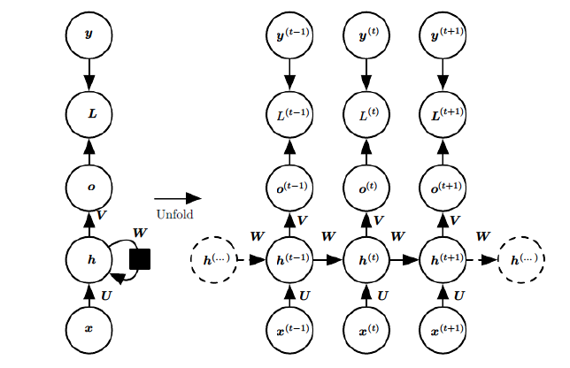

# RNN, Recurrent Neural Network

解决的问题：传统的神经网络无法获取时序信息

RNN 的基本单元结构

上图左边部分称作 RNN 的一个 timestep，在这个 timestep 中可以看到，在 $t$ 时刻，输入变量 $x_t$，通过 RNN 的一个基础模块 A，输出变量 $h_t$，而 $t$ 时刻的信息，将会传递到下一个时刻 $t+1$

RNN 解决了短距离的时序依赖问题，长距离会出现梯度消失问题

## 梯度消失问题

如上图所示，为 RNN 模型结构，前向传播过程包括

- 隐藏状态：$h^t=\sigma(z^t)=\sigma(Ux^t+Wh^{t-1}+b)$，此处激活函数一般为 $tanh$
- 模型输出：$o^t=Vh^t+c$
- 预测输出：$\hat{y}^t=\sigma(o^t)$
- 模型损失：$L=\sum^T_{t=1}L^t$

RNN 所有 timestep 共享一套参数 $U,V,W$，在 RNN 反向传播过程中，需要计算 $U,V,W$ 等参数的梯度，以 $W$ 的梯度表达式为例：
$$
\frac{\partial L}{\partial W}=
\sum_{t=1}^T \frac{\partial L}{\partial y^T} \frac{\partial y^T}{\partial o^T} \frac{\partial o^T}{\partial h^T} \left( \prod_{k=t+1}^{T} \frac{\partial h^k}{\partial h^{k-1}} \right) \frac{\partial h^t}{\partial W} 
= \sum_{t=1}^{T} \frac{\partial L}{\partial y^T} \frac{\partial y^T}{\partial o^T} \frac{\partial o^T}{\partial h^T} \left( \prod_{k=t+1}^{T} tanh^{'}(z^k) W \right) \frac{\partial h^t}{\partial W}
$$
公式中 $tanh$ 总是小于 1 的，由于是 $T-(t+1)$ 个 timestep 参数的连乘，如果 W 的主特征值小于 1，梯度会消失，如果 W 的特征值大于 1，梯度会爆炸

RNN 中权重在各 timestep 内共享，最终的梯度是各个 timestep 的梯度和，梯度和会越来越大，总的梯度是不会消失的，即使梯度越传越弱，也只是远距离的梯度消失。RNN 梯度消失的真正含义：梯度被近距离（$t+1$ 趋向于 $T$）梯度主导，远距离（$t+1$ 远离 $T$）梯度很小，导致模型难以学到远距离的信息