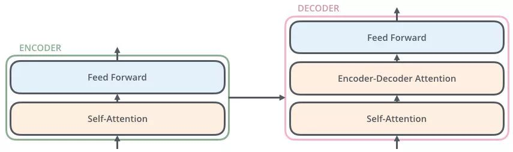

# Position Embedding

Attention 值的计算最终会被加权求和，会丢失序列顺序信息

Transformer 的提出者提出了 Position Embedding，即对于输入 X 进行 Attention 计算之前，在 X 的词向量加上位置信息
$$
X_{final\_embedding}=Emebedding+Positional\ Embedding
$$
位置编码公式
$$
{PE}_{(pos,2i)}=sin(\frac{pos}{{10000}^{\frac{2i}{d_{model}}}})\\
{PE}_{(pos,2i+1)}=cos(\frac{pos}{{10000}^{\frac{2i}{d_{model}}}})
$$
Position Embedding 本身是一个绝对位置的信息。借助三角函数的性质
$$
\left\{\begin{matrix}
sin(\alpha+\beta)=sin\alpha cos\beta + cos\alpha sin\beta\\
cos(\alpha+\beta)=cos\alpha cos\beta - sin\alpha sin\beta
\end{matrix}\right.
$$
可以得到
$$
\left\{\begin{matrix}
PE(pos+k,2i)=PE(pos,2i)\times PE(k,2i+1)+PE(pos,2i+1)\times PE(k,2i)\\
PE(pos+k,2i+1)=PE(pos,2i+1)\times PE(k,2i+1)-PE(pos,2i)\times PE(k,2i)
\end{matrix}\right.
$$
可以看出，对于 `pos+k` 位置的位置向量某一维 `2i` 或 `2i+1` 而言，可以表示为 `pos` 位置与 `k` 位置的位置向量的 `2i` 与 `2i+1` 维的线性组合，这样的线性组合意味着位置向量中蕴含了相对位置信息

# Transformer

一种架构，一种新型的序列到序列模型，能够在处理长序列数据时避免传统的循环神经网络（Recurrent Neural Network，RNN）中存在的梯度消失问题

关键组件包括多头注意力机制和残差连接等

## Encoder

浅粉色的 z1 是 Self-Attention 获得的词向量，表征仍是 thinking，拥有位置特征、句法特征、语义特征

黄色 x1 作为残差结构的直连向量，直接和浅粉色的 z1 相加，之后进行 Layer Norm 操作，得到粉色 z1

- 残差结构的作用：避免出现梯度消失
- Layer Norm 的作用：为了保证数据特征分布的稳定性，并且可以加速模型的收敛

粉色 z1 经过前馈神经（Feed Forward）层，经过残差结构与自身相加，之后经过 LN 层，得到一个输出向量 r1

- 该前馈神经网络包括两个线性变换和一个 ReLU 激活函数
  $$
  FFN(x)=max(0,xW_1+b_1)W_2+b_2
  $$

## Decoder

### 为什么 Decoder 需要做 Mask

为了解决训练阶段和测试阶段的不匹配（主要 mask 训练阶段的输入）

- 训练阶段：解码器会有输入，这个输入是目标语句，每次都会把所有信息告诉解码器
- 测试阶段：解码器会有输入，但此时测试是不知道目标语句是什么，此时每生成一个词，就会有多一个词放入目标语句中

### 为什么 Encoder 给予 Decoders 的是 K、V 矩阵

Q 的目的是借助它从一堆信息中找到重要的信息

当我们生成词时，通过已经生成的词和源语句做自注意力，确定源语句中哪些词对接下来的词的生成更有作用

## Tokenizer 分词器

> 将文本输入转化为模型可以接受的输入（数值型的输入）

### 类别

#### Word-based

> 按照词进行分词

分词方式

- 根据空格
- 根据标点符号

每个单词被赋予一个 ID，范围为：0～vocabulary size

不在 vocabulary 库里面的词，会分配 `UNK`，代表未知词

缺点

- 相近的词被分配完全不同的无关的 id

#### Character-based

> 按照字符进行分词

优点

- vocabulary size 很小
- 很少机会会出现 out of vocabulary 问题

缺点

- 文本无意义
- 每个模型都需要处理多个 token，模型速度慢，可以输入的文本长度变小

#### Subword-based

> 按照 subword进行分词

原则

- 常见词不应该分成 subword，不常见的词应该分为更有意义的 subword

### load & save

> 加载和保存 tokenizer 使用的模型结构以及字典

load：`from_pretrained`

save：`save_pretrained`

### Encoding

包含两个步骤

- tokenization：调用 `tokenize` 函数，对文本进行分词
- convert_tokens_to_ids：调用 `convert_tokens_to_ids` 函数，将分词后的 token 映射为数字

### Decoding

使用 `decode` 函数，将输出的 ids 转化为文本
