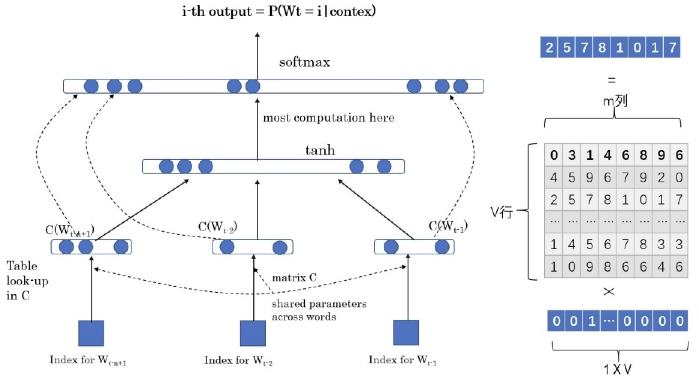

# 语言模型

给定一句由 𝑛 个词组成的句子 $W=w_1,w_2,\dots,w_n$，计算这个句子的概率  $P(w_1,w_2,\dots,w_n)$，或者根据上文计算下一个词的概率 $P(w_n|w_1,w_2,\dots,w_{n-1})$

## 统计语言模型

基本思想是计算条件概率

给定一句由 𝑛 个词组成的句子 $W=w_1,w_2,\dots,w_n$，计算这个句子的概率  $P(w_1,w_2,\dots,w_n)$ 的公式如下（条件概率乘法公式的推广，链式法则）
$$
P(w_1,w_2,\dots,w_n)=P(w_1)P(w_2|w_1)P(w_3|w_1,w_2)\cdots P(w_n|w_1,w_2,\dots,w_{n-1})=\prod_iP(w_i|w_1,w_2,\dots,w_{i-1})
$$
当词的字典很大时，直接使用上述公式进行下一词的预测将会十分困难（每个词都枚举一遍，但很显然有很多词是毫无相关的），这里可以引入马尔科夫链的概念：假设 $w_i$ 只和它之前的 k 个词有相关性，k = 1 时称为一个单元语言模型，k = 2 时称为二元语言模型

当数据很稀疏时，在计算概率时可能会出现 0 的情况，为了避免这种情况的出现，可以在计算时都给分子加上 1，分母加上词的字典的大小

## 神经网络语言模型 NNLM

引入神经网络架构来估计单词的分布，并且通过词向量的距离衡量单词之间的相似度，因此，对于未登录单词，也可以通过相似词进行估计，进而避免出现数据稀疏问题

上图为神经网络语言模型结构图，它的学习任务是：输入某个句中单词 $w_n=bert$ 前的 n - 1 个单词，要求网络正确预测单词 bert，即最大化
$$
P(w_n=bert|w_1,w_2,\dots,w_{n-1};\theta)
$$
上述的神经网络语言模型分为三层

- 输入层：将前 n - 1 个单词用 Onehot 编码作为原始单词输入，之后乘以一个随机初始化的矩阵 Q 后获得词向量 $C(w_i)$，对这 n - 1 个词向量处理后得到输入 $x=(C(w_1),C(w_2),\dots,C(w_{n-1}))$
- 隐含层：包含 h 个隐变量，H 代表权重矩阵，因此隐层的输出为 $Hx+d$，其中 d 为偏置项。并且在此之后使用 $tanh$ 作为激活函数
- 输出层：一共有 $|V|$ 个输出节点（字典大小），直观上讲，每个输出节点 $y_i$ 是词典中每一个单词概率值。最终得到的计算公式为$y=softmax(b+Wx+Utanh(d+Hx))$，其中 W 是直接从输入层到输出层的权重矩阵，U 是隐层到输出层的参数矩阵